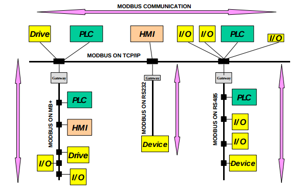
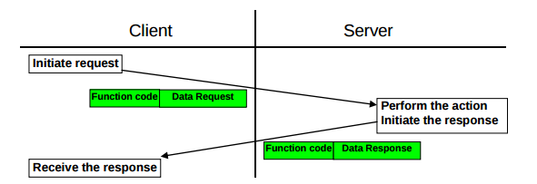
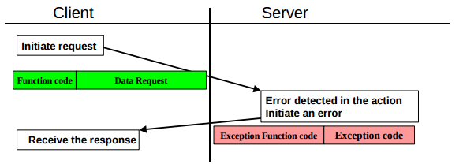

# ModBus

** [Modbus Spec](#modbus-spec) **
* [Abbreviations](#abbreviations)
* [Flavors of ModBus](#flavors-of-modbus)
* [Basics](#basics)
* [Transactions in Modbus](#transactions-in-modbus)

** [Dev and Testing Setups](#dev-and-testing-setups) **
* [Single Box Dev Environment](#single-box-dev-environment)

## Modbus Spec

More detailed information can be found in a few different places. Here is summarized what was gathered from all the blaces listed below:

[ModBus](http://www.modbus.org)

[Simply ModBus](http://www.simplymodbus.ca/)

[ModBus Test Kit](https://github.com/ljean/modbus-tk)

[Sunspec](http://www.sunspec.org)

[Sunspec Simulator](https://github.com/emdem/sunspec-sim)

[PySunSpec](https://github.com/sunspec/pysunspec)

## Abbreviations

ADU  Application Data Unit

HDLC High level Data Link Control

MB   ModBus

MDAP ModBus Application Protocol

PDU  Protocol Data Unit

PLC  Programmable Logic Controller

## Flavors of ModBus

There are many ways to use ModBus. Most inverters/batteries are ModBus RTU on RS485.



## Basics

Modbus is master/slave with the master running the Client and the slaves running Servers. So long as the slaves are on the same bus and have seperate addresses, the master can transact with them.


Error free transactions between client and server:





More on Modbus exceptions later... However, if an exception occured at some point during the transaction and it did not time-out it looks like this:





## Transactions in ModBus

Modbus defines a PDU independent of the underlying communication layer. On specific networks/buses, there may be additional fields in the ADU we have to deal with.


The ADU is built by the client that initiates a transaction. The Function Code determines what action to take. We will mostly deal with 0x01 and 0x04 primarily (read coil and read input register respectively) for reading and 0x05, 0x06 and 0x10 (write coil, write register and write registers respectively).

Modbus uses big-Endian notation, so this may be confusing at first. The most significant byte always gets sent first and bytes are 8 bits typically.

Coils can be thought of as booleans - a single bit.

Registers can be thought of as words and their size can vary. For most of our applications, it seems to be two 8 bit values per register. So integers from 0 ... 65536.


## Dev and Testing setups


Initially, there will only be single box modbus RTU over RS485. But there will need to be greater flexibility and potentially long running test server implementations for clients.


## Single Box Dev Environment

You can use a null modem emulator like tty0tty or use socat. tty0tty is less trouble to persist from boot to boot.

If you don't have a RS485 cable for development, that's ok, we can convert a normal CAT5 cable into an adequate RS485 cable for short distances. You can use 2 serial to RS485 connectors or one serial and one USB RS485 connector. I used one USB and one serial com port based RS485 connector on my dev box.

To make the cable, cut the ends off the CAT5 cable if it has them. Strip all the smaller wires inside. There should be 8 total. Take care not to remove any of the copper fibers with the stripper. After all of them are stripped, twist together the solid with the corresponding stripe.

This is what it should look like:


Since we are doing Modbus RTU, we only need 4 of the ports. I connected mine as follows on the USB RS485 connector:


I connected the com port based RS485 connector to the only serial port on my dev box:


### Setting up the test server

Clone [this](https://github.com/emdem/sunspec-sim) repository containing a simple sunspec simulator written by some badass - I simply forked and lightly modified it.

Since it requires a serial port, you will have to run with sudo or change the permissions on the serial port. I connected my RS485 connector to the first serial port, which is `/dev/ttyS0` on my dev box.

```
sudo python modsim.py -s /dev/ttyS0 -v 1 -m rtu -i 1 mbmap_test_device.xml
```

To adjust the baud/parity/slave id/base address/etc, modify the sim code - this will all be configurable eventually. Once the simulator is running, if there were no issues, you should see something like this:
```
Initialized modbus rtu simulator: baud = 9600  parity = N  slave id = 1  base address = 40000
Modbus map loaded from mbmap_test_device.xml
Added modbus map block:  address = 40000  count = 939
'quit' for closing the simulator
modbus_tk.simulator is running...
```

If not, something went wrong. If everything went smoothly, you can start connecting with a client.

Once you start reading and writing registers on the server from a test-client, you can confirm the setup is working with a multimeter by connecting the ground and either the T/R- or the T/R+.
